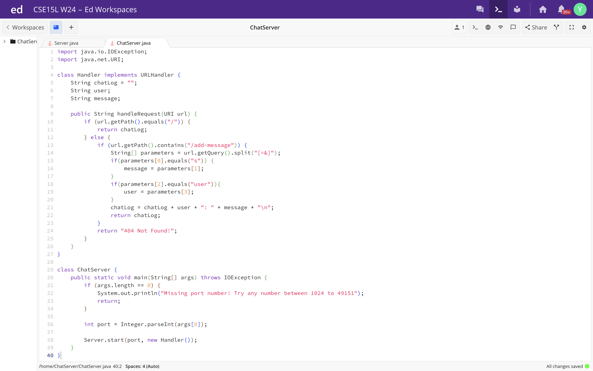
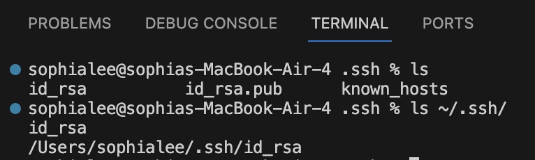
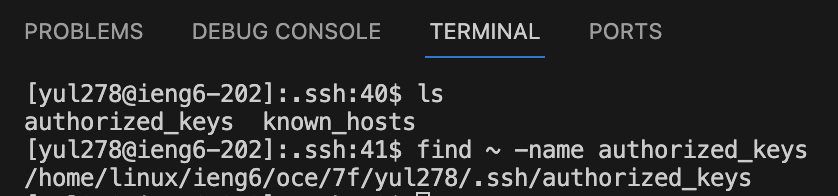
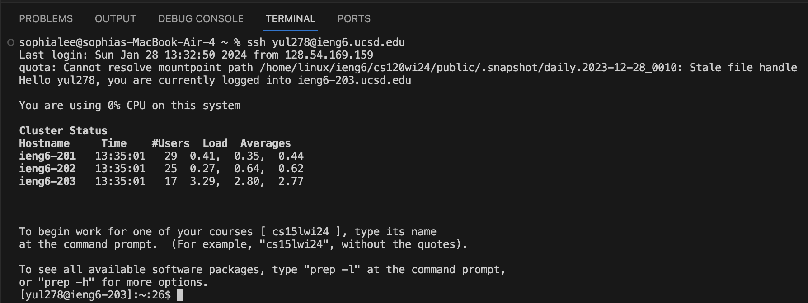

# Lab Report 2 - Servers and SSH Keys
## Part 1

### Using ```/add-message```
.png)
In this example, the ```handleRequest``` method is called and takes the user input URI("http://100.116.44.247:4899/add-message?s=Hello&user=jpolitz") as the argument. The ```handleRequest``` method checks the path of the URI. Since the URI contains ```/add-messages ``` the method dissects the query key-value pair, assigning the words after ```?s=``` to ```String message``` and the words after ```&user=``` to ```String user```. Thus, ```message``` has the value "Hello" and ```user``` has the value "jpolitz". The ```chatLog``` string gets appended with ```user + ": " + message + "\n"``` and returned. Now, ```chatLog``` has the value "jpolitz: Hello".

.png)
In this example, the ```handleRequest``` method is called again and takes the user input URI("http://100.116.44.247:4899/add-message?s=How%20are%20you&user=yash") as the argument. The ```handleRequest``` method checks the path of the URI. Since the URI contains ```/add-messages ``` the method dissects the query key-value pair, assigning the words after ```?s=``` to ```String message``` and the words after ```&user=``` to ```String user```. Consequently, ```message``` has the value "How are you" and ```user``` has the value "yash". The ```chatLog``` string gets appended with ```user + ": " + message + "\n"``` and returned. Finally, ```chatLog``` has the value "jpolitz: Hello\nyash: How are you".   

## Part 2
### Absolute path to the private key

The absolute path to the ```private key``` is ```/Users/sophialee/.ssh/id_rsa```.

### Absolute path to the public key

The absolute path to the ```private key``` is ```/home/linux/ieng6/oce/7f/yul278/.ssh/authorized_keys```.

### Login without password


## Part 3
In week 2 I learned how to use ```ssh``` to connect to a remote server from my computer, specifically the ieng6 server. This is supplemented by week 3 when I learned to access my ieng6 account with a private key without the use of my password. In addition, I gained a better understanding of how to build and run a server. For example, I learned how to program different paths to my server and use the query to retrieve user input. Furthermore, I learned that others on the same network can access my server and their changes are reflected for everyone on the server. 


