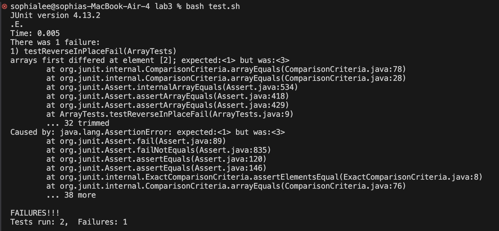

# Lab Report 3 - Symptoms and Failure-inducing Inputs
## Part 1
### Failure-inducing input for ListExamples merge() method:
```
@Test
    public void testListMergeFail() {
        List<String> list1 = new ArrayList<>();
        list1.add("a");
        list1.add("c");
        list1.add("e");

        List<String> list2 = new ArrayList<>();
        list2.add("b");
        list2.add("d");
        list2.add("f");

        List<String> expected = new ArrayList<>();
        expected.add("a");
        expected.add("b");
        expected.add("c");
        expected.add("d");
        expected.add("e");
        expected.add("f");

        assertEquals(expected, ListExamples.merge(list1,list2));
	}
```
### Input that doesn't induce failure:
```
  @Test
    public void testListMergePass() {
        List<String> list1 = new ArrayList<>();
        list1.add("a");
        list1.add("b");
        list1.add("c");

        List<String> list2 = new ArrayList<>();

        List<String> expected = new ArrayList<>();
        expected.add("a");
        expected.add("b");
        expected.add("c");


        assertEquals(expected, ListExamples.merge(list1,list2));
	}
```
### The symptom:


### The bug:
#### Before:
```
static List<String> merge(List<String> list1, List<String> list2) {
    List<String> result = new ArrayList<>();
    int index1 = 0, index2 = 0;
    while(index1 < list1.size() && index2 < list2.size()) {
      if(list1.get(index1).compareTo(list2.get(index2)) < 0) {
        result.add(list1.get(index1));
        index1 += 1;
      }
      else {
        result.add(list2.get(index2));
        index2 += 1;
      }
    }
    while(index1 < list1.size()) {
      result.add(list1.get(index1));
      index1 += 1;
    }
    while(index2 < list2.size()) {
      result.add(list2.get(index2));
      index1 += 1;
    }
    return result;
  }
```
#### After:
```
static List<String> merge(List<String> list1, List<String> list2) {
    List<String> result = new ArrayList<>();
    int index1 = 0, index2 = 0;
    while(index1 < list1.size() && index2 < list2.size()) {
      if(list1.get(index1).compareTo(list2.get(index2)) < 0) {
        result.add(list1.get(index1));
        index1 += 1;
      }
      else {
        result.add(list2.get(index2));
        index2 += 1;
      }
    }
    while(index1 < list1.size()) {
      result.add(list1.get(index1));
      index1 += 1;
    }
    while(index2 < list2.size()) {
      result.add(list2.get(index2));
      index2 += 1;
    }
    return result;
  }
```

In the third while loop, ```index1``` was incorrectly incremented when ```index2``` is the one that should be incremented when adding the remaining elements of ```list2``` to the ```result``` list. This mistake causes an ```out-of-memory exception``` as the while loop is never exited and the same element from ```list2``` is repeatedly added to the ```result``` list until there is no more memory in the heap.

## Part 2
### ```grep -r``` command 

The ```grep -r``` command is used to recursively search directories and files for an identified pattern. (Found through ```man grep```)

#### Used on files:
```
sophialee@sophias-air-4 docsearch % grep -r "common" ./technical/biomed/rr37.txt ./technical/biomed/rr73.txt
./technical/biomed/rr37.txt:        Asthma is a common condition in general medical
./technical/biomed/rr73.txt:        in vivo tissue contraction, a common
```
The ```grep -r``` command is used from the ```docsearch``` directory to find the character pattern "common" from files ```./technical/biomed/rr37.txt``` and ```./technical/biomed/rr73.txt```. The command outputs the occurrences of "common" in the specified files with some context. 

#### Used on directory:
```
sophialee@sophias-air-4 docsearch % grep -r "common type" ./technical/biomed
./technical/biomed/1472-6807-2-2.txt:        comprehensive report available describing the common types
./technical/biomed/1471-5945-1-3.txt:        common type of cancer in the United States and results in
./technical/biomed/1471-2458-2-21.txt:        This is the most common type of condition. The two
./technical/biomed/gb-2002-3-3-research0011.txt:          There are three common types of values that can be
./technical/biomed/1471-2164-2-4.txt:        polymorphisms (SNPs), the most common type of human genetic
```
The ```grep -r``` command is used from the ```docsearch``` directory to find the character pattern "common type" from the ```./technical/biomed``` directory. The command outputs the occurrences of "common" in the specified files. The command outputs the occurrences of "common type" in the specified directory with some context. 

### ```grep -c``` command 

The ```grep -c``` command is used to count the number of occurrences of an indicated character pattern in a file or multiple files. (Found through ```man grep```)

#### Used on files:
```
sophialee@sophias-air-4 docsearch % grep -c "common" ./technical/biomed/rr37.txt ./technical/biomed/rr73.txt
./technical/biomed/rr37.txt:1
./technical/biomed/rr73.txt:1
```
The ```grep -c``` command is used from the ```docsearch``` directory to find the number of occurrences of the character pattern "common" from files ```./technical/biomed/rr37.txt``` and ```./technical/biomed/rr73.txt```. The command output shows that "common" appeared once in each file. 

#### Used on directory:
```
sophialee@sophias-air-4 docsearch % grep -c "approve" -r ./technical/government/Env_Prot_Agen
./technical/government/Env_Prot_Agen/multi102902.txt:1
./technical/government/Env_Prot_Agen/section-by-section_summary.txt:4
./technical/government/Env_Prot_Agen/jeffordslieberm.txt:0
./technical/government/Env_Prot_Agen/final.txt:0
./technical/government/Env_Prot_Agen/ctf7-10.txt:0
./technical/government/Env_Prot_Agen/ctf1-6.txt:2
./technical/government/Env_Prot_Agen/ro_clear_skies_book.txt:1
./technical/government/Env_Prot_Agen/ctm4-10.txt:0
./technical/government/Env_Prot_Agen/1-3_meth_901.txt:0
./technical/government/Env_Prot_Agen/atx1-6.txt:3
./technical/government/Env_Prot_Agen/tech_sectiong.txt:0
./technical/government/Env_Prot_Agen/bill.txt:40
./technical/government/Env_Prot_Agen/nov1.txt:0
./technical/government/Env_Prot_Agen/tech_adden.txt:3
```
The ```grep -c``` command is used from the ```docsearch``` directory. It requires the use of the ```-r``` command to be used with a directory and recursively search the files in the ```./technical/government/Env_Prot_Agen``` directory. The command output shows the number of occurrences of "approve" in each file. 

### ```grep -v```
The ```grep -v``` command is used to print the lines without the indicated character pattern in a file or multiple files. (Found through ```man grep```)

#### Used on file:
```
sophialee@sophias-MacBook-Air-4 docsearch % grep -v "a" ./technical/biomed/1471-2490-3-2.txt ./technical/biomed/1471-2334-3-13.txt
./technical/biomed/1471-2490-3-2.txt:
./technical/biomed/1471-2490-3-2.txt:  
./technical/biomed/1471-2490-3-2.txt:    
./technical/biomed/1471-2490-3-2.txt:      
./technical/biomed/1471-2490-3-2.txt:      
./technical/biomed/1471-2490-3-2.txt:      
./technical/biomed/1471-2490-3-2.txt:        Methods
./technical/biomed/1471-2490-3-2.txt:        to the lower border of symphysis pubis using 5 mm
./technical/biomed/1471-2490-3-2.txt:      
./technical/biomed/1471-2490-3-2.txt:      
./technical/biomed/1471-2490-3-2.txt:        Results
./technical/biomed/1471-2490-3-2.txt:      
./technical/biomed/1471-2490-3-2.txt:      
./technical/biomed/1471-2490-3-2.txt:        Discussion
./technical/biomed/1471-2490-3-2.txt:        on this subject.
./technical/biomed/1471-2490-3-2.txt:      
./technical/biomed/1471-2490-3-2.txt:      
./technical/biomed/1471-2490-3-2.txt:        Conclusion
./technical/biomed/1471-2490-3-2.txt:        diverticulitis.
./technical/biomed/1471-2490-3-2.txt:      
./technical/biomed/1471-2490-3-2.txt:      
./technical/biomed/1471-2490-3-2.txt:        Competing interests
./technical/biomed/1471-2490-3-2.txt:      
./technical/biomed/1471-2490-3-2.txt:      
./technical/biomed/1471-2490-3-2.txt:        Authors' contribution
./technical/biomed/1471-2490-3-2.txt:        writing
./technical/biomed/1471-2490-3-2.txt:      
./technical/biomed/1471-2490-3-2.txt:    
./technical/biomed/1471-2490-3-2.txt:  
./technical/biomed/1471-2334-3-13.txt:
./technical/biomed/1471-2334-3-13.txt:  
./technical/biomed/1471-2334-3-13.txt:    
./technical/biomed/1471-2334-3-13.txt:      
./technical/biomed/1471-2334-3-13.txt:        
./technical/biomed/1471-2334-3-13.txt:          Testing the hypothesis
./technical/biomed/1471-2334-3-13.txt:          (directly or indirectly) to 
./technical/biomed/1471-2334-3-13.txt:        
./technical/biomed/1471-2334-3-13.txt:        
./technical/biomed/1471-2334-3-13.txt:          including 
./technical/biomed/1471-2334-3-13.txt:          E. coli O157:H7 [ 9 ] . Although
./technical/biomed/1471-2334-3-13.txt:          Furthermore, this 
./technical/biomed/1471-2334-3-13.txt:          (verotoxin-producing) 
./technical/biomed/1471-2334-3-13.txt:          E. coli [ 30 31 ] . This
./technical/biomed/1471-2334-3-13.txt:          E. coli .
./technical/biomed/1471-2334-3-13.txt:        
./technical/biomed/1471-2334-3-13.txt:        
./technical/biomed/1471-2334-3-13.txt:          O157-specific; This number does not include the
./technical/biomed/1471-2334-3-13.txt:          E. coli K-12
./technical/biomed/1471-2334-3-13.txt:          genomes
./technical/biomed/1471-2334-3-13.txt:          function.
./technical/biomed/1471-2334-3-13.txt:          Streptococcus gordonii : [ 35 ] )
./technical/biomed/1471-2334-3-13.txt:          Further testing of this hypothesis will require
./technical/biomed/1471-2334-3-13.txt:          wrote:
./technical/biomed/1471-2334-3-13.txt:          
./technical/biomed/1471-2334-3-13.txt:          
./technical/biomed/1471-2334-3-13.txt:        
./technical/biomed/1471-2334-3-13.txt:        
./technical/biomed/1471-2334-3-13.txt:          If 
./technical/biomed/1471-2334-3-13.txt:        
./technical/biomed/1471-2334-3-13.txt:      
./technical/biomed/1471-2334-3-13.txt:      
./technical/biomed/1471-2334-3-13.txt:        Competing interests
./technical/biomed/1471-2334-3-13.txt:      
./technical/biomed/1471-2334-3-13.txt:    
./technical/biomed/1471-2334-3-13.txt:  
```
The ```grep -v``` command is used from the ```docsearch``` directory to find the lines that do not contain the character pattern "a" from files ```./technical/biomed/1471-2490-3-2.txt``` and ```./technical/biomed/1471-2334-3-13.txt```. The command output prints the lines that do not contain "a" from the files.

#### Used on directory 
```
#Output shortened to demonstrate functionality

sophialee@sophias-MacBook-Air-4 docsearch % grep -v "a" -r ./technical/911report/
./technical/911report//chapter-7.txt:            THE ATTACK LOOMS
./technical/911report//chapter-7.txt:            FIRST ARRIVALS IN CALIFORNIA
./technical/911report//chapter-7.txt:                    Diego.
./technical/911report//chapter-7.txt:            
./technical/911report//chapter-7.txt:            Two Weeks in Los Angeles
./technical/911report//chapter-7.txt:            
./technical/911report//chapter-7.txt:            
./technical/911report//chapter-7.txt:   
./technical/911report//chapter-9.txt:
./technical/911report//chapter-9.txt:    
./technical/911report//chapter-9.txt:        
./technical/911report//chapter-9.txt:            HEROISM AND HORROR
./technical/911report//chapter-9.txt:            PREPAREDNESS AS OF SEPTEMBER 11
./technical/911report//chapter-9.txt:            
./technical/911report//chapter-9.txt:            
./technical/911report//chapter-9.txt:                of the buildings.
./technical/911report//chapter-9.txt:            
./technical/911report//chapter-9.txt:                to prevent smoke from rising from lower to upper portions of the building; they were
./technical/911report//chapter-9.txt:                every fourth floor.
...
```
The ```grep -v``` command is used from the ```docsearch``` directory. It requires the use of the ```-r``` command to be used with a directory and recursively search the files in the ```./technical/911report/``` directory. The command output show lines from the files in ```./technical/911report/``` without the character pattern "a".


