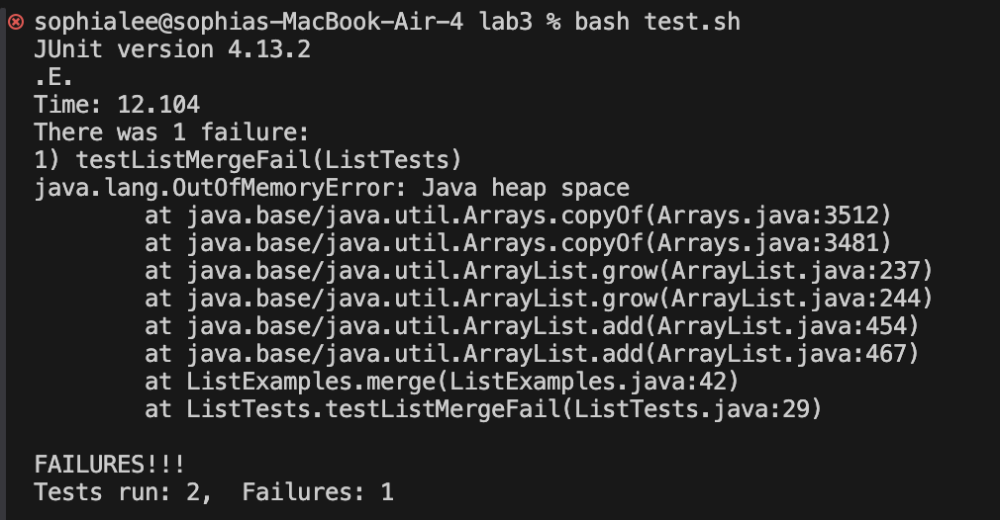

# Lab Report 3 - Symptoms and Failure-inducing Inputs
## Part 1
### Failure-inducing input for ListExamples merge() method:
```
@Test
    public void testListMergeFail() {
        List<String> list1 = new ArrayList<>();
        list1.add("a");
        list1.add("c");
        list1.add("e");

        List<String> list2 = new ArrayList<>();
        list2.add("b");
        list2.add("d");
        list2.add("f");

        List<String> expected = new ArrayList<>();
        expected.add("a");
        expected.add("b");
        expected.add("c");
        expected.add("d");
        expected.add("e");
        expected.add("f");

        assertEquals(expected, ListExamples.merge(list1,list2));
	}
```
### Input that doesn't induce failure:
```
  @Test
    public void testListMergePass() {
        List<String> list1 = new ArrayList<>();
        list1.add("a");
        list1.add("b");
        list1.add("c");

        List<String> list2 = new ArrayList<>();

        List<String> expected = new ArrayList<>();
        expected.add("a");
        expected.add("b");
        expected.add("c");


        assertEquals(expected, ListExamples.merge(list1,list2));
	}
```
### The symptom:


### The bug:
#### Before:
```
static List<String> merge(List<String> list1, List<String> list2) {
    List<String> result = new ArrayList<>();
    int index1 = 0, index2 = 0;
    while(index1 < list1.size() && index2 < list2.size()) {
      if(list1.get(index1).compareTo(list2.get(index2)) < 0) {
        result.add(list1.get(index1));
        index1 += 1;
      }
      else {
        result.add(list2.get(index2));
        index2 += 1;
      }
    }
    while(index1 < list1.size()) {
      result.add(list1.get(index1));
      index1 += 1;
    }
    while(index2 < list2.size()) {
      result.add(list2.get(index2));
      index1 += 1;
    }
    return result;
  }
```
#### After:
```
static List<String> merge(List<String> list1, List<String> list2) {
    List<String> result = new ArrayList<>();
    int index1 = 0, index2 = 0;
    while(index1 < list1.size() && index2 < list2.size()) {
      if(list1.get(index1).compareTo(list2.get(index2)) < 0) {
        result.add(list1.get(index1));
        index1 += 1;
      }
      else {
        result.add(list2.get(index2));
        index2 += 1;
      }
    }
    while(index1 < list1.size()) {
      result.add(list1.get(index1));
      index1 += 1;
    }
    while(index2 < list2.size()) {
      result.add(list2.get(index2));
      index2 += 1;
    }
    return result;
  }
```

In the third while loop, ```index1``` was incorrectly incremented when ```index2``` is the one that should be incremented when adding the remaining elements of ```list2``` to the ```result``` list. This mistake causes an ```out-of-memory exception``` as the while loop is never exited and the same element from ```list2``` is repeatedly added to the ```result``` list until there is no more memory in the heap.

## Part 2
### ```grep -r``` command 

The ```grep -r``` command is used to recursively search directories and files for an identified pattern. (Found through ```man grep```)

#### Used on files:
```
sophialee@sophias-air-4 docsearch % grep -r "common" ./technical/biomed/rr37.txt ./technical/biomed/rr73.txt
./technical/biomed/rr37.txt:        Asthma is a common condition in general medical
./technical/biomed/rr73.txt:        in vivo tissue contraction, a common
```
The ```grep -r``` command is used from the ```docsearch``` directory to find the word pattern "common" from files ```./technical/biomed/rr37.txt``` and ```./technical/biomed/rr73.txt```. The command outputs the occurrences of "common" in the specified files. 

#### Used on directories:
```
sophialee@sophias-air-4 docsearch % grep -r "common type" ./technical/biomed
./technical/biomed/1472-6807-2-2.txt:        comprehensive report available describing the common types
./technical/biomed/1471-5945-1-3.txt:        common type of cancer in the United States and results in
./technical/biomed/1471-2458-2-21.txt:        This is the most common type of condition. The two
./technical/biomed/gb-2002-3-3-research0011.txt:          There are three common types of values that can be
./technical/biomed/1471-2164-2-4.txt:        polymorphisms (SNPs), the most common type of human genetic
```
The ```grep -r``` command is used from the ```docsearch``` directory to find the word pattern "common" from the ```./technical/biomed``` directory. The command outputs the occurrences of "common" in the specified files. The command outputs the occurrences of "common" in the specified directories. 


